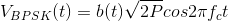

**Designing**

We will be using MATLAB to design / implement the objectives.

* The first objective i.e generating bpsk will be based on the formula &nbsp;&nbsp;  &nbsp;&nbsp;where b(t) in a timeperiod will be depicted by the bit i.e b(t) will be -1 if 0 or +1 if 1.

* For all the (Eb/N0) SNR vs BER curves will be simulated by creating errors and calculating the BER accordingly to varying SNR.

* For the theoretical values for comparision respective formulas will be used directly.

* Medium changes will also be a parameter taken for writing the algorithm. (We will be using only AWGN and Rayleigh fading channel).
