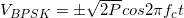
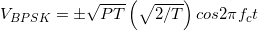
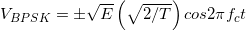
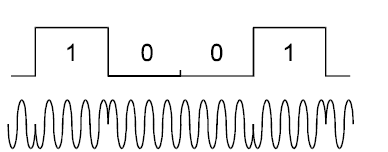
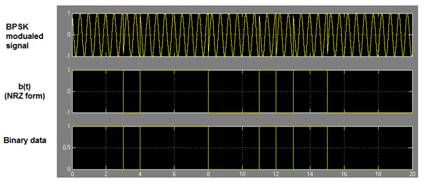
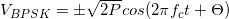
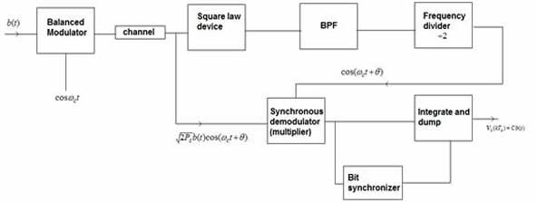
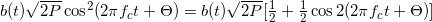
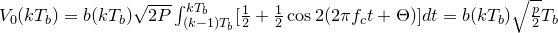
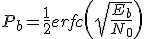

# Introduction

&nbsp;&nbsp;&nbsp;&nbsp;Digital to Analog conversion is a process of transforming a digital signal into its corresponding analog signal. Digital signals having discrete amplitudes at discrete time instants are converted into a continuous analog signal both in case of amplitude and time in this process. In analog transmission, the sending device produces a high-frequency signal that acts as a base for the information signal called the carrier signal or carrier frequency. The receiving device is tuned to the frequency of the carrier signal that it expects from the sender. Digital information then changes the carrier signal by modifying one or more of its characteristics (amplitude, frequency, or phase). This kind of modification is called modulation (shift keying).

## Phase Shift Keying

&nbsp;&nbsp;&nbsp;&nbsp;In phase shift keying (PSK), the phase of a carrier is changed according to the modulating waveform which is a digital signal. In BPSK, the transmitted signal is a sinusoid of fixed amplitude. It has one fixed phase when the data is at one level and when the data is at the other level, phase is different by 180 degree. A Binary Phase Shift Keying (BPSK) signal can be defined as

 &nbsp;&nbsp;&nbsp;&nbsp;&nbsp;&nbsp;, where 0 &le; t &le; T

where **b(t) = +1 or -1**,  **fc**  is the carrier frequency, and _T_ is the bit duration. The signal has a power **P = A2/2**, so that **A = &radic;2P**, where **A** represents the peak value of sinusoidal carrier.

Thus the above equation can be written as

&nbsp;&nbsp;&nbsp;&nbsp;, where  E = PT is the energy contained in the bit duration.

 &nbsp;

**Figure.1** shows  the BPSK signal for bit sequence 1001,

The received signal has the form &nbsp;  &nbsp; , where &Theta; is the phase shift introduced by the channel. The signal **b(t)** is recovered in the **demodulator**. If **synchronous demodulation** is used, the waveform **cos(2&pi;fct + &Theta;)** is required at the demodulator. Carrier recovery scheme in the demodulator is shown in Figure.2.

**Figure.2** BPSK modulator and demodulator

The recovered carrier is multiplied with the received signal to generate

Assuming that integral number of carrier cycles is present in bit duration **Tb** , voltage **v0(kTb)** and the bit synchronizer in Figure.2 knows the end of a bit interval and beginning of the next, the output  voltage **v0(kTb)** at the output of the integrate and dump circuit is:

If the channel is noisy, some of the demodulated bits will be in error.

**Bit Error Rate and Eb/N0 :**

&nbsp;&nbsp;&nbsp;&nbsp;Signal to noise ratios and Eb/N0 figures are parameters that are more associated with radio links and radio communications systems. In terms of this, the bit error rate, BER, can also be defined in terms of the probability of error or POE. To determine this, three other variables are used. They are the error function, erf, the energy in one bit, Eb, and the noise power spectral density (which is the noise power in a 1 Hz bandwidth), N0.

The energy per bit, Eb, can be determined by dividing the carrier power by the bit rate and is a measure of energy with the dimensions of Joules. N0 is a power per Hertz and therefore this has the dimensions of power (joules per second) divided by seconds). Looking at the dimensions of the ratio Eb/N0 all the dimensions cancel out to give a dimensionless ratio. It is important to note that POE is proportional to Eb/N0 and is a form of signal to noise ratio.

It is possible to define the bit error rate in terms of a probability of error.

where:

erfc = error function

Eb = energy in one bit

N0 = power spectral density (noise in 1Hz bandwidth).

It is important to note that Eb/N0 is a form of signal to noise ratio.

The energy per bit, Eb can be determined by dividing the carrier power by the bit rate. As an energy measure, Eb has the unit of Joules. N0 is a measure of power (joules per second) per Hz, and as a result Eb/N0 is a dimensionless term and can be expressed simply as a ratio.

The error probability is seen to fall off monotonically with an increase in distance between the signals.