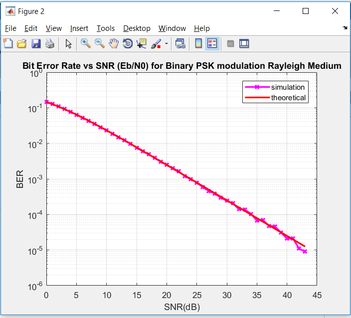

# Data Communications (CO250): Mini-Project

**Title:**

Performance analysis of state-of-the-art Digital-to-Analog Conversion techniques
using Binary Phase Shift Keying (BPSK).

**Members:**

Ishaan R Dharamdas (16CO117) - <ishaanrd6@gmail.com>

Uday Aditya V R (16CO149) - <aditya.uday999@gmail.com>

Prajval M (16CO234) - <26prajval98@gmail.com>

**Abstract:**

PSK (Phase shift Keying) is a type of digital modulation which occurs when the carrier wave
is modulated by it’s phase to deliver the message. In the most simple sense of PhaseShift Keying,
a 0 can be represented as 180 degree phase shift and 1 can be represented by 0 degree phase shift.
As there are only two phases used it is called 2-PSK, or Binary PSK (BPSK).

PSK, unlike FSK or ASK, makes efficient use of bandwidth and is less susceptible to errors and is more immune to noise.

Bit Error Rate (BER) is the rate at which error occurs in the transmission of digital data.
These bits are a result of alteration due to noise, interference, distortion or bit
synchronization errors. BER is the most effective factor for measuring performance of BPSK.
In this project, we analyize the performance of BPSK with the help of BER.

**Objectives:**

* Generate BPSK modulated analog signal using digital signal: Our code will be used to generate the modulated wave from the digital signal, keeping 0 as a cosine function with 180 degree lag and 1 as a cosine function with 0 degree lag.

* Performance analysis using bit error rate comparing theoretical and practical scenarios: the code will output a graph of Bit Error Rate vs SNR.

* Performance analysis using bit error rate comparing Binary Phase Shift Keying to other Phase Shift Keying: This will compare probability of BER error with respect to BPSK and other PSK like QPSK, 8-PSK, 16-PSK.

* Performance analysis of binary phase shift keying based upon different channels like AWGN, Rayleigh.

**References:**

[1] L. F. Rahman, F. A. Rudham, M. B. I. Reaz and M. Marufuzzaman, "The evolution of digital to analog converter," 2016 International Conference on Advances in Electrical, Electronic and Systems Engineering (ICAEES), Putrajaya, 2016, pp. 151-154.
doi: 10.1109/ICAEES.2016.7888028

URL: <http://ieeexplore.ieee.org/stamp/stamp.jsp?tp=&arnumber=7888028&isnumber=7887989>

[2] M. M. Madankar and P. S. Ashtankar, "Performance analysis of BPSK modulation scheme for different channel conditions," 2016 IEEE Students' Conference on Electrical, Electronics and Computer Science (SCEECS), Bhopal, 2016, pp. 1-5.
doi: 10.1109/SCEECS.2016.7509290

URL: <http://ieeexplore.ieee.org/stamp/stamp.jsp?tp=&arnumber=7509290&isnumber=7509260>

[3] Suzi Seroja Sarnin, N. Kadri, Aiza Mahyuni Mozi, Norfishah Ab Wahab and Nani Fadzlina Naim, "Performance analysis of BPSK and QPSK using error correcting code through AWGN," 2010 International Conference on Networking and Information Technology, Manila, 2010, pp. 178-182.
doi: 10.1109/ICNIT.2010.5508536

URL: <http://ieeexplore.ieee.org/stamp/stamp.jsp?tp=&arnumber=5508536&isnumber=5508441>

## File Structure

* Introduction.md - explain theoretical aspects of the mini project.

* Design.md - explain design aspects of the mini project.

* main.m - main module of implementation.

* AWGN.m - function which simulates a wired medium by adding white gaussian noise to the signal.

* RY.m - function which simulates a wireless medium. This is using Rayleigh fading.

* comparision_1.m - computes performance of BPSK in AWGN channel.

* comparision_2.m - computes performance of BPSK in Rayleigh medium.

* comparision_3.m - displays comparision of BPSK, QPSK, 8-PSK and 16-PSK.

* comparision_4.m - compares BER vs SNR for AWGN and Rayleigh fading channels

* modulationBPSK.m - modulation of digital signals to BPSK form. Instead of cosine wave a square wave is shown for ease of implementation.

* demod.m - demodulation of BPSK wave to digital signals.

**Output Images**

**Conclusions**

* The key factor which determines the performance of BPSK is Bit Error Rate. Bit Error Rate determines the number of bit errors in the signal taking the SNR , transmission type and the medium into consideration. Hence , performance analysis is done based on BER in this project.

* For the same SNR value, the bit error rate for a wired medium is less than that of a wireless medium. Therefore even with a lesser value of SNR same signal can be sent with lower value of BER through a AWGN channel.

* Comparision of BPSK, QPSK, 8-PSK and 16-PSK shows that the probability of bit error for a given SNRdB value is the least for BPSK and QPSK which have the same value. It is the highest for 16-PSK. Thus BPSK is more suitable than 8-PSK and 16-PSK in terms of BER.

* The theoretical value of BER is a lower bound for the simulation value of BER in an AWGN channel. This is because in theory, we assume the number of 1s and 0s to be equal, which leads to a minimization approximation making BER_th for AWGN as lower bound.

* All the results have been verified with the help of the following links:

    * [Phase-shift keying wikipedia] (https://en.wikipedia.org/wiki/Phase-shift_keying)
    
    * [BER simulation vs theoretical for AWGN channel](https://dsp.stackexchange.com/questions/26703/bit-error-rate-curves-theoretical-and-simulation)
    
    * [Performance of BER in AWGN channel](https://www.youtube.com/watch?v=v5jZSm6lMwU&t=5s)
    
    * [Bit Error Rate of AWGN wired channel](https://www.youtube.com/watch?v=-qUQrImVZog&t=114s)
    
    * [Bit Error Rate of Rayleigh Fading wireless channel] (https://youtu.be/PHiCIWHqQQM)